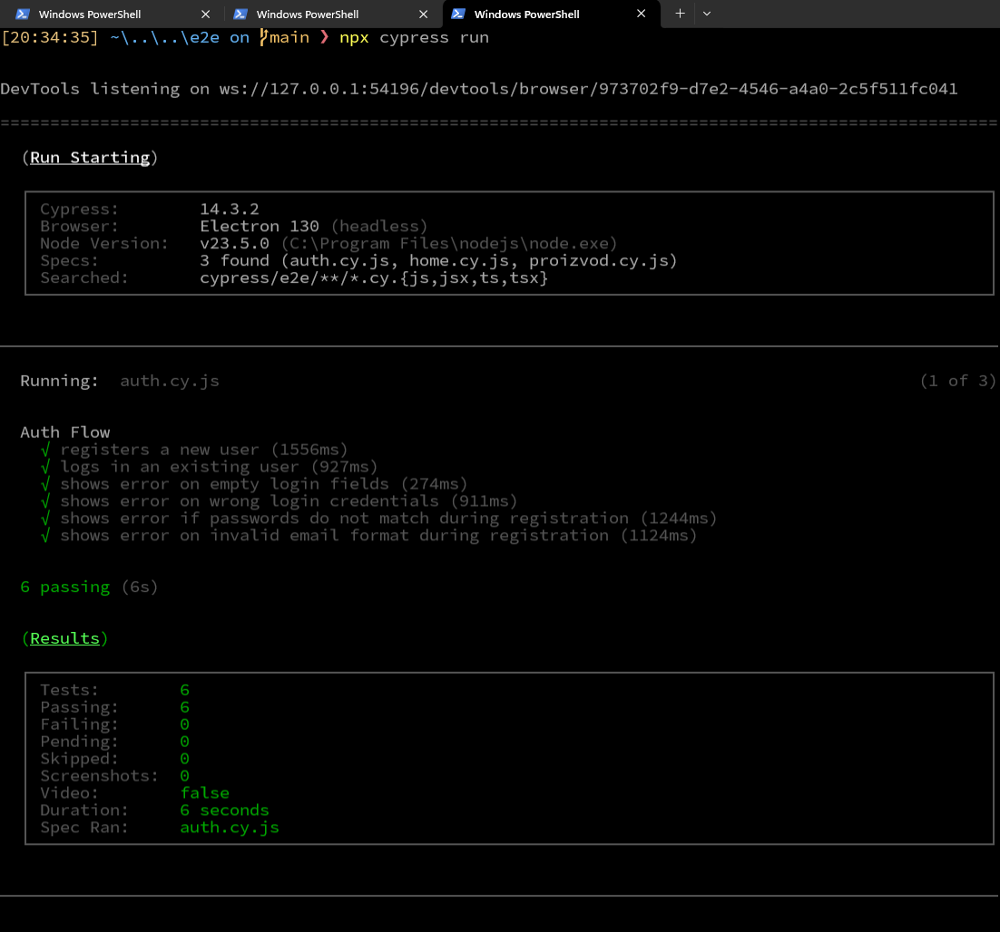

\thispagestyle{empty}

\vspace*{4cm}

\begin{center}
  {\Large \textbf{Univerzitet u Zenici}} \\[4em]
  {\large \textbf{Politehnički Fakultet}} \\[4em]

  {\LARGE \textbf{Seminarski Rad:}} \\[1.5em]
  {\Large \textbf{End-to-End (E2E) testiranje u React aplikacijama koristeći Cypress}} \\[1em]
  {\large \textbf{Predmet: Kontrola Kvaliteta Softvera}} \\[4em]

  \normalsize
  Autori: Hamza Gačić, Safet Imamović \\[1em]
  Maj 2025. godine
\end{center}


\newpage

\setcounter{page}{1}  
\tableofcontents  

\newpage


# Uvod

U današnjem dinamičnom razvoju softvera, garantovanje visoke kvalitete aplikacija predstavlja neophodan korak u životnom ciklusu projekta. Automatizirano testiranje omogućava bržu validaciju funkcionalnosti, smanjenje mogućih grešaka i osigurava da krajnji proizvod zadovoljava očekivanja korisnika. Ovaj rad će se fokusirati na end-to-end testiranje React aplikacija korištenjem Cypress alata[^1][@cypress_docs], koji svojim modernim pristupom i integracijom s Node.js backendom omogućava efikasno i intuitivno testiranje.

## Šta je Cypress?

Cypress je moderan JavaScript framework za end-to-end testiranje web aplikacija. Razvio se s ciljem da zamijeni tradicionalne alate poput Seleniuma, pružajući brži, pouzdaniji i lakši način testiranja. Njegove karakteristike uključuju:
- **Brz razvoj i izvršavanje testova:** Cypress pokreće testove direktno u pregledniku, što omogućava brzi feedback.
- **Sinhroni API:** Iako se radi o asinhronom okruženju, Cypress omogućava pisanje testova na način koji liči na sinhroni kod, olakšavajući razumijevanje i razvoj.
- **Integracija s razvojnim alatima:** Pruža mogućnost praćenja grešaka, vizualizacije izvršenih testova te jednostavno podešavanje u okviru CI/CD procesa.[^6][@ci_testing_react]

## Osnove automatiziranog testiranja React aplikacija
React je jedna od najpopularnijih JavaScript biblioteka[^2][@react_docs] za izgradnju korisničkih interfejsa. Automatizirano testiranje React aplikacija omogućava:
- **Validaciju UI komponenata:** Provjera ispravnosti prikaza i funkcionalnosti komponenti.
- **Regresiono testiranje:** Brza detekcija grešaka nakon promjena ili nadogradnji aplikacije.
- **Kros-platformsko testiranje:** Osiguravanje da aplikacija radi ispravno u različitim preglednicima i uređajima.

Cypress nudi alate za direktnu interakciju s DOM-om React aplikacija, omogućavajući precizno lociranje elemenata i validaciju interakcija korisnika.

# Historija Cypressa

## Evolucija alata i razvojna zajednica

Cypress je lansiran početkom 2015. godine kao open-source projekt s ciljem pojednostavljivanja procesa automatiziranog testiranja. Glavni razvojni ciljevi bili su:
- **Brže izvršavanje testova:** U usporedbi s tradicionalnim alatima.
- **Pojednostavljena integracija:** Sa svim modernim web tehnologijama, uključujući React.
- **Intuitivno korisničko sučelje:** Za pisanje, debugiranje i vizualizaciju testova.

Danas, Cypress ima široku zajednicu developera koja redovno doprinosi poboljšanjima i novim pluginovima. Zajednica je ključna za kontinuirani razvoj alata, što osigurava da Cypress ostane u koraku s najnovijim trendovima u web razvoju.

## Utjecaj i poslovni procesi

Korištenje Cypressa u poslovnim procesima omogućava organizacijama da:
- **Smanje vrijeme razvoja:** Brže se pronalaze i otklanjaju greške.
- **Automatiziraju CI/CD procese:** Integriraju testiranje unutar kontinuirane integracije i isporuke softvera.
- **Osiguraju visoku kvalitetu proizvoda:** Pravilno funkcioniranje aplikacije smanjuje mogućnost grešaka u produkciji.

Mnoge tehnološke kompanije prepoznale su prednosti Cypressa i integrirale ga u svoje razvojne tokove, čime su ostvarile značajnu uštedu vremena i resursa.

# Zašto je Cypress Popularan?

## Ključne prednosti Cypressa

Cypress nudi niz prednosti koje ga izdvajaju:
- **Jednostavnost instalacije i konfiguracije:** Instalacija se obavlja pomoću npm paketa, što olakšava postavljanje okruženja.
- **Intuitivan API:** Omogućava pisanje testova s minimalnim kodom, što smanjuje krivulju učenja.
- **Brza dijagnostika grešaka:** Integrirani debugger i vizualni prikazi izvršenja testova omogućavaju brže pronalaženje problema.
- **Real-time ponovno učitavanje testova:** Automatsko ponovno pokretanje testova nakon promjena u kodu.

## Open-source pristup i cross-platform podrška

Kao open-source alat, Cypress:
- **Omogućava transparentnost:** Izvorni kod je dostupan svima, što potiče inovacije i dodatne prilagodbe.
- **Podržava širok spektar preglednika:** Testovi se mogu izvršavati na Chrome, Firefox, Edge i drugim modernim preglednicima.
- **Olakšava razvoj:** Zajednica doprinosi dodatnim pluginovima, proširenjima i alatima za integraciju u druge sisteme.

## Industrijski use case: Primjena u stvarnim projektima

Primjeri korištenja Cypressa u industriji pokazuju:
- **Brzu implementaciju testova:** Mnoge kompanije uspješno primjenjuju Cypress u svojim agilnim procesima.
- **Povećanu stabilnost proizvoda:** Automatizacija testiranja pomaže u otkrivanju regresija prije produkcije.
- **Skalabilnost:** Testiranje većeg broja funkcionalnosti bez povećanja kompleksnosti testnih skripti.

# Arhitektura i Način Rada Cypressa

## Arhitektura Cypress Frameworka

Cypress radi prema modernoj arhitekturi koja omogućava direktnu interakciju s preglednikom. Ključni elementi arhitekture su:
- **Test Runner:** Aplikacija koja izvršava testove unutar preglednika i omogućava vizualizaciju svakog koraka.
- **API za testiranje:** Sinhroni API koji omogućava jednostavno lociranje elemenata, interakciju s DOM-om i validaciju stanja aplikacije.
- **Integracijski sloj s backendom:** Node.js backend je osnova za izvršavanje testova, pristupanje konfiguracijskim datotekama te generisanje izvještaja.

## Način Rada – Sinhroni Pristup Testiranju

Cypress se izdvaja po tome što koristi sinhroni pristup, što omogućava:
- **Jednostavno čitanje koda:** Test skripte se pišu na način koji liči na standardni proceduralni kod, bez potrebe za rukovanjem asinkronim pozivima.
- **Automatsku sinkronizaciju:** Cypress automatski čeka da se elementi pojave u DOM-u prije nego nastavi s izvršavanjem naredbi.
- **Poboljšanu stabilnost testova:** Manja je mogućnost pojave "flaky" testova, što rezultira pouzdanijim rezultatima.

## Uloga Node.js Backenda u Test Okruženju

Node.js služi kao temelj za rad Cypressa[^3][@nodejs_docs]:
- **Izvršavanje testova:** Svi testovi se pokreću unutar Node.js okruženja, omogućavajući brzo izvršavanje.
- **Konfiguracija i upravljanje test okruženjem:** Node.js omogućava rad s konfiguracijskim datotekama (npr. cypress.json) i integraciju s alatima za kontinuiranu integraciju.
- **Generisanje izvještaja:** Rezultati testova se mogu dalje obrađivati i prikazivati pomoću alata koji su integrirani s Node.js ekosistemom.

\newpage

# Upotreba Cypressa u React Aplikacijama

## Instalacija i Konfiguracija

Instalacija Cypressa je jednostavna zahvaljujući npm-u. Osnovni koraci su:

1. **Inicijalizacija Node.js projekta:**
   ```bash
   mkdir react-cypress-test
   cd react-cypress-test
   npm init -y
```

2. **Instalacija Cypressa:**

   ```bash
   npm install cypress --save-dev
   ```
3. **Pokretanje Cypressa:**

   ```bash
   npx cypress open
   ```
4. **Konfiguracija okruženja:**
   U datoteci `cypress.json` definiraju se osnovne postavke kao što su URL aplikacije, timeout vrijednosti i putanje do testova.

\newpage

## Pisanje Test Slučajeva

Pisanje test slučajeva u Cypressu je intuitivno zahvaljujući njegovom API-ju:

* **Testovi slučaja za login/register funkcionalnost:**

`auth.cy.js`:
```javascript
 describe('Auth Flow', () => {
  const email = 'newuser@example.com';
  const password = 'newpass123';

  it('registers a new user', () => {
    cy.visit('http://localhost:5173/register');

    cy.get('input[name="email"]').type(email);
    cy.get('input[name="password"]').type(password);
    cy.get('input[name="confirmPassword"]').type(password);
    cy.get('button[type="submit"]').click();

    cy.url().should('include', '/');
  });

  it('logs in an existing user', () => {
    cy.visit('http://localhost:5173/login');

    cy.get('input[name="email"]').type(email);
    cy.get('input[name="password"]').type(password);
    cy.get('button[type="submit"]').click();

    cy.url().should('include', '/');
  });

  it('shows error on empty login fields', () => {
    cy.visit('http://localhost:5173/login');

    cy.get('button[type="submit"]').click();

    cy.contains('Email is required');
    cy.contains('Password is required');
  });

  it('shows error on wrong login credentials', () => {
    cy.visit('http://localhost:5173/login');

    cy.get('input[name="email"]').type('wrong@example.com');
    cy.get('input[name="password"]').type('wrongpass');
    cy.get('button[type="submit"]').click();

    cy.log('Submitted login form');
    cy.contains('Invalid email or password', {timeout : 10000});
    cy.log('Found error message');
  });

  it('shows error if passwords do not match during registration', () => {
    cy.visit('http://localhost:5173/register');

    cy.get('input[name="email"]').type('another@example.com');
    cy.get('input[name="password"]').type('password123');
    cy.get('input[name="confirmPassword"]').type('differentPass');
    cy.get('button[type="submit"]').click();

    cy.contains('Lozinke se ne podudaraju'); // promijenjeno
  });

  it('shows error on invalid email format during registration', () => {
    cy.visit('http://localhost:5173/register');

    cy.get('input[name="email"]').type('invalidemail');
    cy.get('input[name="password"]').type('password123');
    cy.get('input[name="confirmPassword"]').type('password123');
    cy.get('button[type="submit"]').click();

    cy.contains('Unesite ispravan email'); // promijenjeno
  });
}); 
```

\newpage

`home.cy.js`:
```javascript
describe('Početna', () => {
  beforeEach(() => {
    cy.visit('http://localhost:5173/');
  });

  it('should display the hero title', () => {
    cy.get('h1').contains('Dobrodošli u budućnost kupovine').should('exist');
  });

  it('should load and display products', () => {
    cy.get('section').eq(1).find('div[class*=card]').should('have.length.greaterThan', 0);
  });

  it('should display product details', () => {
    cy.get('section').eq(1).find('div[class*=card]').first().within(() => {
      cy.get('h2').should('exist').and('not.be.empty');
      cy.get('p').should('have.length.greaterThan', 1);
    });
  });

  it('should have a functional "Dodatni Info" button', () => {
    cy.get('section').eq(1).find('div[class*=card]').first().within(() => {
      cy.get('button').contains('Dodatni Info').should('exist').click();
    });
    cy.url().should('include', '/proizvod/');
  });
});
```
\newpage

`proizvod.cy.js`:
```javascript
describe('Detalji Proizvoda', () => {
  const productId = 5;
  const productUrl = `http://localhost:5173/proizvod/${productId}`;

  beforeEach(() => {
    cy.visit(productUrl);
  });

  it('should display the product name as title', () => {
    cy.get('h1').should('exist').and('not.be.empty');
  });

  it('should load and display product details', () => {
    cy.get('[class*="card"]').within(() => {
      cy.get('h1').should('exist').and('not.be.empty'); // naziv proizvoda
      cy.get('div[class*="rating"]').should('exist');
      cy.get('p[class*="description"]').should('exist').and('not.be.empty');
      cy.get('p[class*="price"]').should('exist').and('contain.text', '$');
      cy.get('button').contains('Add to Cart').should('exist');
    });
  });


  it('should handle loading state', () => {
    cy.intercept('GET', `http://localhost:5000/server/proizvod/${productId}`, (req) => {
      req.on('response', (res) => {
        res.setDelay(2000);
      });
    }).as('getProduct');

    cy.visit(productUrl);
    
    cy.wait('@getProduct');
  });

  it('should handle server error gracefully', () => {
    cy.intercept('GET', `http://localhost:5000/server/proizvod/${productId}`, {
      statusCode: 500,
      body: { error: 'Internal Server Error' },
    }).as('getProductError');

    cy.visit(productUrl);
    cy.contains('h1', 'Error:').should('exist');
  });
});
```


* **Validacija UI interakcija:**
  Cypress omogućava provjeru vidljivosti elemenata, ispravnosti sadržaja i izvršavanje drugih provjera bez dodatne konfiguracije.

## Integracija s CI/CD procesima

Integracija Cypressa s kontinuiranom integracijom omogućava:

* **Automatsko pokretanje testova nakon svakog push-a:**
  Konfiguracijom unutar Jenkins, GitHub Actions ili CircleCI može se automatski pokrenuti izvršavanje testova.[^4][@cypress_guide]
* **Generisanje izvještaja:**
  Alati poput Mochawesome omogućavaju kreiranje detaljnih izvještaja koji se arhiviraju i pregledavaju.
* **Paralelno izvršavanje testova:**
  Skalabilnost se povećava kroz raspodjelu testova na više instanci, čime se skraćuje ukupno vrijeme testiranja.[^5][@web_testing]

# Prednosti i Ograničenja

## Prednosti Cypressa

* **Brzina izvršenja:** Testovi se pokreću izravno u pregledniku, što značajno ubrzava cijeli proces.
* **Jednostavna instalacija i konfiguracija:** Zahvaljujući Node.js ekosistemu i npm-u, postavljanje je brzo i jednostavno.
* **Bogata dokumentacija i zajednica:** Opsežna dokumentacija i aktivna zajednica pomažu pri rješavanju problema i dodatnim optimizacijama.
* **Integrirani debugger:** Vizualni prikaz testova omogućava brzu dijagnostiku i ispravljanje grešaka.
* **Podrška za moderne web tehnologije:** Savršeno se uklapa u razvojne tokove React aplikacija te omogućava testiranje kompleksnih korisničkih sučelja.

## Ograničenja i Izazovi

* **Podrška samo za web preglednike:** Cypress nije namijenjen testiranju native mobilnih aplikacija, što može biti ograničenje za hibridne projekte.
* **Problemi sa asinhronim operacijama:** Iako Cypress sinhronizira naredbe, kod ekstremnih slučajeva mogu se pojaviti izazovi koji zahtijevaju dodatnu pažnju.
* **Resursno zahtjevno okruženje:** Pokretanje testova na više instanci može zahtijevati snažniji hardver, osobito pri paralelnom izvršavanju.
* **Ograničeno debugging sučelje:** Iako je debugger moćan, ponekad složeni scenariji zahtijevaju dodatnu integraciju s drugim alatima za detaljniju analizu.

# Praktična Primjena Cypressa

## Postavljanje Lokalnog Test Okruženja

Za uspješno testiranje React aplikacije pomoću Cypressa potrebno je:

* **Postaviti Node.js backend:**
  Osigurati da su svi potrebni paketi instalirani te konfigurirati server za lokalno pokretanje aplikacije.
* **Kreirati testne datoteke:**
  Organizirati strukturu direktorija tako da su testovi smješteni u `cypress/integration`, a konfiguracijske datoteke u korijenu projekta.

## Izvršavanje Testova i Analiza Rezultata

Cypress nudi mogućnost pokretanja testova kroz CLI ili grafičko sučelje:

* **Pokretanje testova putem CLI-a:**

  ```bash
  npx cypress run
  ```

{#fig:slika}

* **Analiza rezultata:**
  Nakon izvršenja, rezultati se mogu pregledati putem generiranih izvještaja, a greške se detaljno prikazuju s opisima i stack trace-om.
* **Vizualna inspekcija:**
  Koristeći Cypress Test Runner, testeri mogu pratiti svaki korak test slučaja u realnom vremenu, što omogućava bržu detekciju anomalija.


# Dodatne Informacije o Projektnom Okruženju

## Dockerizacija Projekta

Projekat koji koristi Cypress za E2E testiranje u potpunosti je dockerizovan, čime se omogućava jednostavno postavljanje i održavanje razvojnog okruženja. Docker omogućava izolaciju servisa i stabilnu replikaciju okruženja na više mašina. U projektu se koriste tri osnovne komponente:

* **Backend** – Node.js servis pokrenut na portu 5000
* **Frontend** – React aplikacija pokrenuta na portu 5173
* **Baza podataka** – udaljeni MySQL server hostovan na Aiven.io

### Docker Compose konfiguracija:

```yaml
services:
  backend:
    build:
      context: ./backend
    command: npm run dev
    container_name: backend
    ports:
      - "5000:5000"
    volumes:
      - ./backend:/app
      - /app/node_modules
    networks:
      - app-network
    environment:
      NODE_ENV: development
      DB_HOST: mysql
      DB_USER: admin
      DB_PASSWORD: admin
      DB_NAME: mysql

  frontend:
    build:
      context: ./frontend
    command: npm run dev
    ports:
      - "5173:5173"  
    volumes:
      - ./frontend:/app
      - /app/node_modules
    working_dir: /app
    networks:
      - app-network
    environment:
      - VITE_BACKEND_URL=http://localhost:5000

networks:
  app-network:
    driver: bridge
```

## Pokretanje aplikacije i test okruženja

Aplikacija se pokreće lokalno kroz niz jednostavnih komandi:

```bash
# Backend
cd backend
npm start

# Frontend
cd frontend
npm run dev

# Cypress GUI
cd e2e
npx cypress open

# Cypress headless
cd e2e
npx cypress run
```

Ova struktura omogućava paralelno razvijanje i testiranje frontend i backend komponenata.

# Preporuke za Unapređenje Test Okruženja

1. **CI/CD automatizacija:** Dodati GitHub Actions workflow za automatsko pokretanje Cypress testova na svakom pushu.
2. **Mock podaci:** Koristiti Cypress fixtures za predvidljive i stabilne podatke.
3. **Visual regression testing:** Uvesti alate poput Percy ili Applitools za provjeru UI promjena.
4. **Kombinovano testiranje:** Upariti E2E testove s unit i integration testovima za kompletnu pokrivenost.

# Budući Pravci Razvoja

Cypress i dalje evoluira, a neka od područja koja se mogu dodatno istražiti u okviru ovog projekta uključuju:

* Integracija sa Storybook za testiranje komponenti u izolaciji
* Korištenje Cypress Studio za automatsku generaciju testova
* Uvođenje test coverage izvještaja
* Pokretanje testova u više preglednika kroz Cypress Dashboard

# Zaključak

Cypress predstavlja revolucionaran alat u domenu end-to-end testiranja web aplikacija, osobito za moderne React projekte. Njegove prednosti – brzina izvršenja, intuitivnost, bogata dokumentacija i snažna zajednica – čine ga idealnim izborom za razvojne timove koji žele brzo i efikasno otkrivati greške te osigurati visok nivo kvalitete softvera. Iako postoje određena ograničenja, prednosti koje Cypress nudi daleko nadmašuju izazove, a integracija s Node.js backendom dodatno osigurava skalabilnost i održivost test okruženja.

Implementacijom Cypressa u razvojni ciklus, organizacije mogu značajno ubrzati proces testiranja, smanjiti broj regresijskih grešaka i osigurati stabilnost aplikacija koje se svakodnevno koriste. Budući da se tehnologija neprestano razvija, Cypress će vjerojatno nastaviti s evolucijom i postati još moćniji alat u arsenalu QA inženjera.


[^1]: Cypress Documentation. https://docs.cypress.io (Pristupljeno: 28. april 2025)  
[^2]: React Official Documentation. https://reactjs.org/docs/getting-started.html (Pristupljeno: 28. april 2025)  
[^3]: Node.js Official Website. https://nodejs.org/ (Pristupljeno: 28. april 2025)  
[^4]: Test Automation with Cypress – A Comprehensive Guide. https://www.cypress.io/blog/ (Pristupljeno: 28. april 2025)  
[^5]: Modern Web Testing with Cypress. Autor: [Ime autora]. Objavljeno: 2023, dostupno na: [URL članka]  
[^6]: Continuous Integration and Testing in React Applications. https://www.smashingmagazine.com (Pristupljeno: 28. april 2025)

